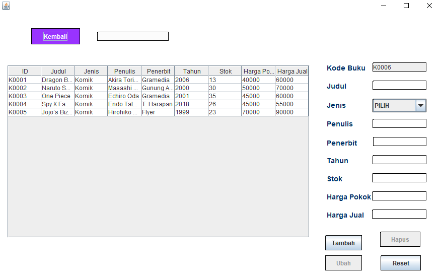

# CuyBuku 📚


Sebuah aplikasi GUI toko buku berbasis Java. Aplikasi ini menggunakan module Swing untuk tampilan GUI, dan database MySQL untuk menyimpan data, serta mengimplementasikan pattern MVC.

Aplikasi ini ditujukan untuk tugas akhir mata kuliah **Pemrograman Berorientasi Objek**.

Dibuat oleh:
- [NaufalMuh11](https://github.com/NaufalMuh11)
- [haikalrafifas](https://github.com/haikalrafifas)
- [Sammmuelll](https://github.com/Sammmuelll)
- [kevinrasen](https://github.com/kevinrasen)

<br>

# Showcase

<div style="display: flex; flex-wrap: wrap; gap: 10px; margin-bottom: 24px;">
   
   
   
   
   
   
</div>

# Untuk Tester

Berikut adalah software yang dibutuhkan untuk menjalankan aplikasi ini:

|Software|Versi Minimal|Deskripsi|
|-|-|-|
|**JDK**|9|Wajib|
|**MySQL**|8|Wajib (disarankan dari XAMPP)|
|**NetBeans**|20|Opsional|
|**Apache Ant**|1|Opsional|

Setelah semua software diatas telah diinstall, lalu berikut adalah langkah untuk menjalankan aplikasi ini:

1. Nyalakan server `MySQL` (jika menggunakan XAMPP, buka control panel XAMPP lalu mulai MySQL). Jika menggunakan CLI bisa menggunakan perintah dibawah:
   ```
   mysqld --datadir="/path/to/your-mysql-datadir" --console
   ```
2. Import file `db_javabuku.sql` ke database MySQL, baik melalui `phpMyAdmin` maupun MySQL CLI dengan cara:
   ```
   mysql -u root < db_javabuku.sql
   ```
3. Jalankan aplikasi, jika menggunakan NetBeans maka tarik folder `AplikasiTokoBuku` ini ke NetBeans, lalu klik tombol `F6` untuk menjalankan aplikasi.

   Namun, jika Anda ingin menggunakan CLI, maka anda harus menginstall `Apache Ant` dan lakukan perintah dibawah:
   ```
   cd /path/to/this-repo/AplikasiTokoBuku
   ant compile
   ant run
   ```

<br>

# Untuk Kontributor

Cara untuk berkontribusi untuk aplikasi ini:

1. Hubungi repository owner/kontributor aktif agar diberi akses tulis
2. Buat branch tersendiri dengan nama selain main dan development.
3. Ubah konfigurasi kredensial database di `src/database/Config.java` sesuai dengan database yang ada. Disarankan menggunakan `MySQL` yang umum nya satu bundle dengan `XAMPP` karena akun root secara default tidak menggunakan password. Pastikan server database nya sudah berjalan.
4. Lakukan perubahan, namun disarankan untuk menggunakan IDE `Apache Netbeans` untuk mengubah dan testing kode sumber

Aplikasi ini menerapkan framework MVC, sehingga penataan file menjadi lebih sesuai peruntukannya. Berikut adalah penjelasan masing-masing direktori di dalam `src/`:

|Nama Direktori|Deskripsi|
|-|-|
|**assets**|Tempat untuk semua asset yang digunakan pada aplikasi seperti icon, gif, gambar, dll.|
|**controllers**|Tempat menyimpan file controller pada framework MVC.|
|**database**|Tempat untuk file terkait penyimpanan data dan koneksi dengan database SQL|
|**libraries**|Tempat untuk simpan library eksternal, seperti custom library, atau library lainnya yang tidak terdapat dalam Java SE.|
|**models**|Tempat menyimpan file model pada framework MVC.|
|**reports**|Tempat menyimpan file laporan.|
|**views**|Tempat menyimpan file view pada framework MVC.|

Disarankan juga untuk mengikuti konvensi penamaan file dan struktur kode sumber yang konsisten semasa tahap pengembangan.

### MVC Pattern

Aplikasi ini menggunakan beberapa external library, salah satunya bernama `jmvc`. Library ini berguna untuk keperluan aplikasi MVC JFrame seperti navigasi antar halaman `jmvc.Navigator`, dan utility untuk meng-generate file MVC `jmvc.MVCFactory`. Dokumentasi lebih lengkap ada [disini](https://github.com/haikalrafifas/jmvc).


